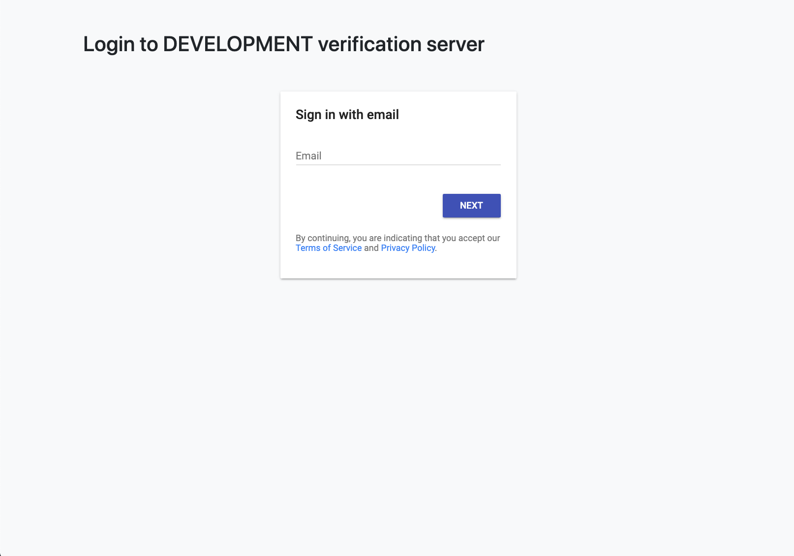
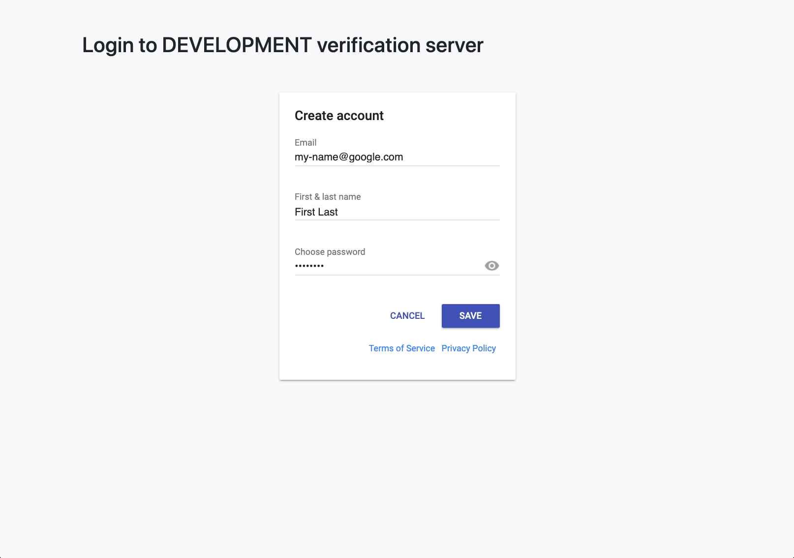
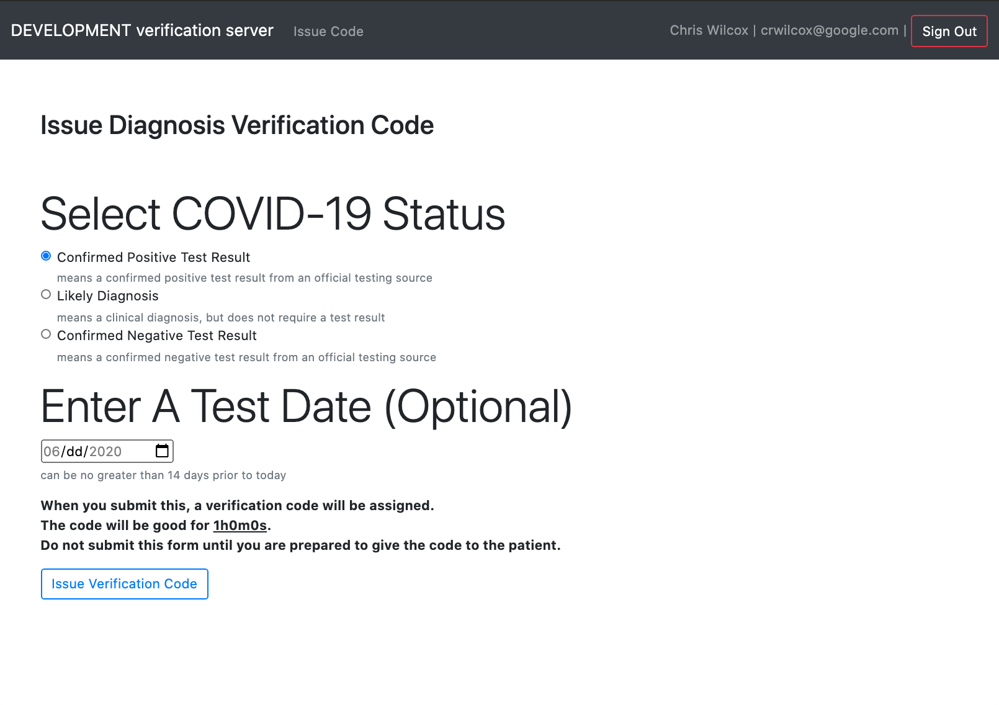
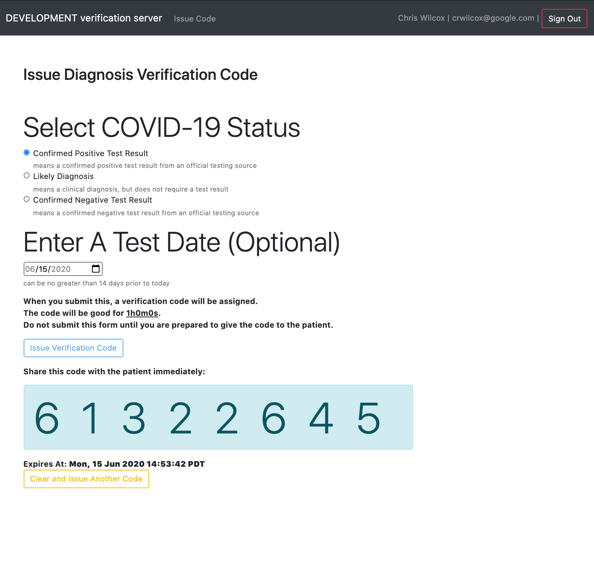

# Temprorary Exposure Key Verification Server

As part of the broader [Google Exposure Notification](https://github.com/google/exposure-notifications-server) reference server efforts, this repository contains a reference to a verification server.

## About the Service

This shows a sample Web interface for issuing a "PIN CODE"

That PIN code has some information about TEKs that might one day be uploaded
with that pin.

When a "mobile app" presents that PIN plus the HMAC of the TEKs, this server
will verify the PIN and sign the claims in a JWT, with optional
additional metadata at the direction of the PHA.

If you wanted to run this yourself, you need to create an asymmetric
ESCDA P256  signing key and swap out the resource ID in cmd/server/main.go

Also, this requires a GCP project, and I assume that you're logged in with
application default credentials.

```shell
gcloud auth login && gcloud auth application-default login
```

## Setup & Running

```shell
gcloud kms keyrings create --location=us signing
gcloud kms keys create phaverification --location=us --keyring=signing --purpose=asymmetric-signing --default-algorithm=ec-sign-p256-sha256
```

To get the resource name

```
gcloud kms keys describe phaverification --keyring=signing2 --location=us
```

You want the name: field, and you need to postfix it with `/cryptoKeyVersions/1`
(or whatever version name you're on).

Set that in your environment (example)

```
export SIGNING_KEY="projects/tek-demo-server/locations/us/keyRings/signing/cryptoKeys/teksigning/cryptoKeyVersions/1"
```

1. `go run ./cmd/server`
2. visit http://localhost:8080
3. Configure and issue a pin (keep the server running)
4. ``go run `./cmd/client -pin ISSUEDPIN` ``
5. Visit https://jwt.io
6. Copy the validation payload into the left side
7. Get the public key from KMS and copy to the right if you want to verify sig.

## An Example

This is a validation payload (JWT)

```
eyJhbGciOiJFUzI1NiIsInR5cCI6IkpXVCJ9.eyJwaGFjbGFpbXMiOnsiYmF0Y2giOiJ0ZXN0IGJhdGNoIG51bWJlciIsImxhYiI6InRlc3QgciB1cyJ9LCJ0cmFuc21pc3Npb25SaXNrcyI6W3sicmlzayI6OCwicGFzdFJvbGxpbmdQZXJpb2RzIjoyMDB9LHsicmlzayI6NCwicGFzdFJvbGxpbmdQZXJpb2RzIjo1MDB9XSwic2lnbmVkbWFjIjoiTXIzNThTclU5Vkx6WlkxaDhrUndDTGFuSHdkNldFRVZZZkpHUUxQNVIvVXZFdUU3YVVMZHVJeUZqOWZoNlJEWm5wRHFTUnlRdXg0bnI5bTl3bUhTRjduaVc1TlRNbVhmQ1FPZVE4ZzlFUUtEcktSWHRQRXVhZ2xOOWVnMEZ0Tk5MK3dWcCt0YkRybDNmTnJ2SGNnRkJjSzRuc1NBRGRSNThWclArZW5nYVZ6ZWxjZnpYa2haQ0ZaRTVmdStsVzlBWkNFSG40dCtsZ2lqYXhZU1l2L0tTcUNHVWlXRzZsUStud09EbTdtNHhCTENORElDMGVUdDVGU1NZeUg0REZmU3FFUDJ0QVJzVDRxT2pQZi9IYzM4RHh2cmF3NEFXTXpvcnd6VUgzTUMrdG9WdEJyVW1WUjV2aTFQQ0c4alczVDN6OVB1RVgzOXpIeTUxeENxb1NlaXFjMGhPZVZFWEVlSml1T2FmM1BNRGloUHdmSG1HRXdyMHVEbVcyV3V6ai9waUdKOTA3VVJUa3VpajdYQzVRcm9QNFBPS1ZHb3hnd05xTW1hZDlsbGN5OGlCbTVBN2YvNEVhbGpla3VmR0FCK2wvSnVHck9EL0VnWmFCeUU3TGVVaE1KT0ZjSWZMRTZMZkg3VTJUWEJIK0lHaXdhQzBVSi91eHdNaXB3cmFEendmNXhpbHFDVExwSWFPVG5QdjcwV1FZRlFsaE5TTkFPdTRFWHBSbkxVN0V6a3AwNElhT1lta05GOE9rL1BHa3cxTTNYVThWU2xyTVQzN3ZTcUZtZ2dDOXppYmFXRmVuNXNBZENnSWNaL0w0MDE5N0d5SHFvUEg0cWsweFZUVVhOb1JFcEd1b0U4aWltcTM3dVZ6OUYzVFBDbGdidHEzNFlyUnBOa1lUZVRkSG89IiwiYXVkIjoiZ292LmV4cG9zdXJlLW5vdGlmaWNhdGlvbnMtc2VydmVyIiwiZXhwIjoxNTkwMjg0Mjg3LCJpc3MiOiJQdWJsaWMgSGVhbHRoIEdvdiJ9.S8RPoVzt_ILKwJBosKDBx_-OVI_gb5hF4f3WzDLcQD_rCJz6rJWGoOLjdfFk3KYlWUcHWogr6i2VEM_0haxPvw
```

That can be verified with this public key.

```
-----BEGIN PUBLIC KEY-----
MFkwEwYHKoZIzj0CAQYIKoZIzj0DAQcDQgAEA+k9YktDK3UpOhBIy+O17biuwd/g
IBSEEHOdgpAynz0yrHpkWL6vxjNHxRdWcImZxPgL0NVHMdY4TlsL7qaxBQ==
-----END PUBLIC KEY-----
```

## Configuring your Development Environment for Running Locally

```shell
gcloud auth login && gcloud auth application-default login

# In case you have this set, unset it to rely on gcloud.
unset GOOGLE_APPLICATION_CREDENTIALS 

# Initialize Dev Settings
eval $(./scripts/dev init)
./scripts/dev dbstart

# Configure These settings to your firebase application
export FIREBASE_API_KEY="YOUR API KEY"
export FIREBASE_PROJECT_ID="YOUR-PROJECT-123456"
export FIREBASE_MESSAGE_SENDER_ID="789123456"
export FIREBASE_APP_ID="1:123456:web:abcd1234"
export FIREBASE_MEASUREMENT_ID="G-J12345C"

export FIREBASE_AUTH_DOMAIN="${FIREBASE_PROJECT_ID}.firebaseapp.com"
export FIREBASE_DATABASE_URL="https://${FIREBASE_PROJECT_ID}.firebaseio.com"
export FIREBASE_STORAGE_BUCKET="${FIREBASE_PROJECT_ID}.appspot.com"

# Migrate DB
./scripts/dev dbmigrate

# create a user for whatever email address you want to use
go run ./cmd/add-users --email YOUR-NAME@DOMAIN.com --name "First Last" --admin true

go run ./cmd/server
```

## A Walkthrough of the Service




